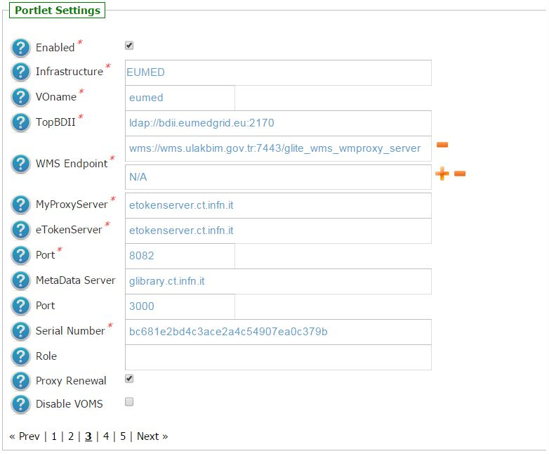
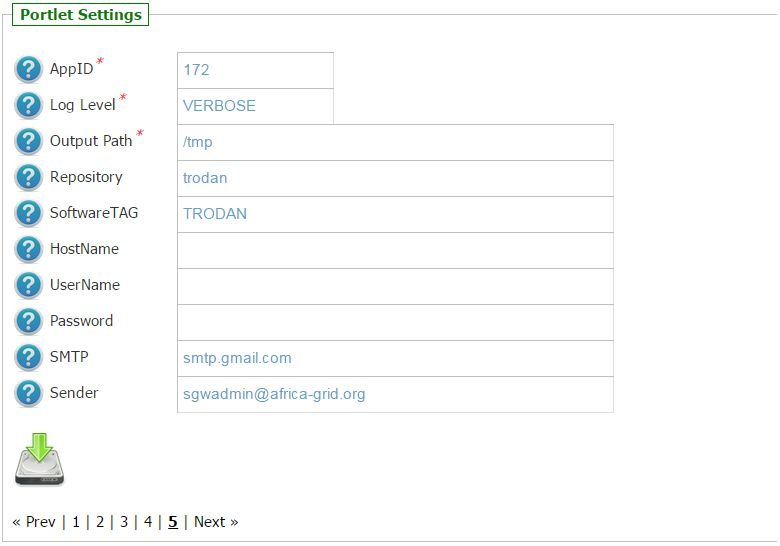
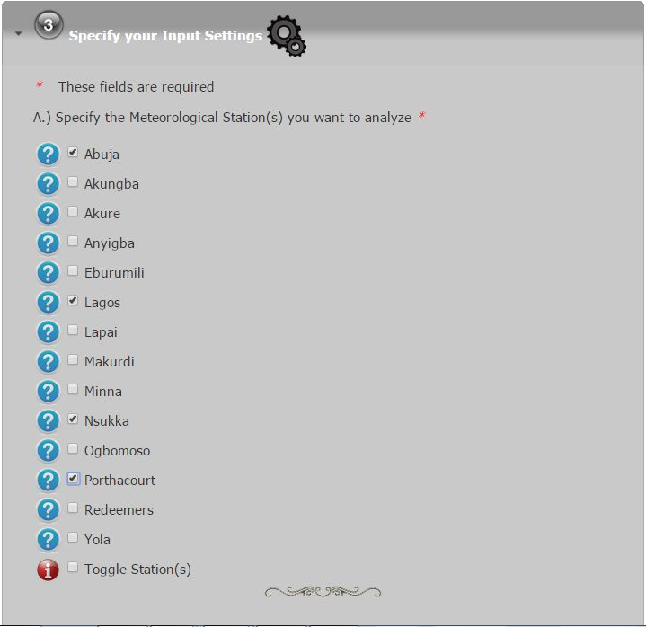
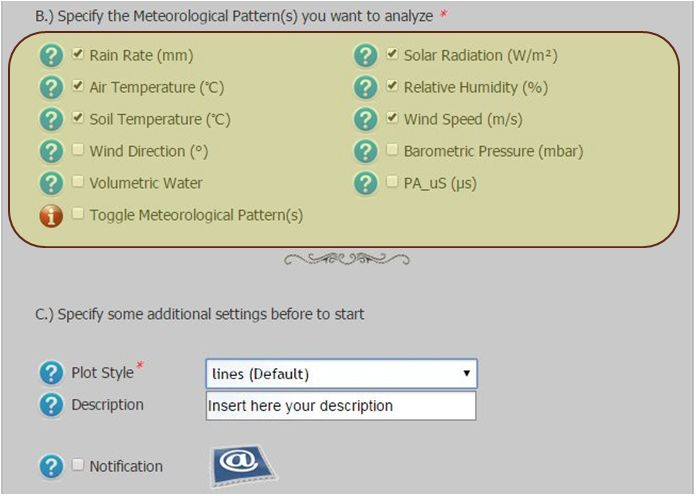
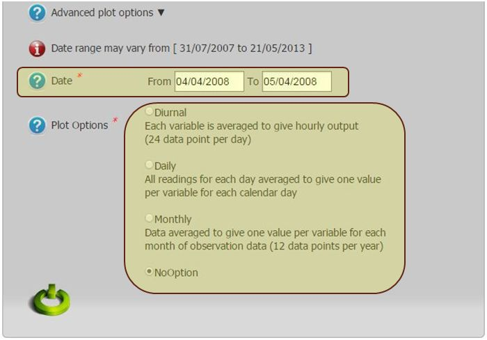

*********************
TRODAN v1.0.3 Docs
*********************

============
About
============

-------------

.. _CAR: http://www.carnasrda.com/
.. _NASRDA: http://nasrda.gov.ng/en/portal/
.. _GNUPLOT: http://www.gnuplot.info/
.. _1: http://www.eumedgrid.eu/
.. _2: https://sgw.africa-grid.org

The Center for Atmospheric Research (CAR_) is an activity Centre of the Nigerian National Space Research and Development Agency, NASRDA_, committed to research and capacity building in the atmospheric and related sciences. 

CAR_ is dedicated to understanding the atmosphere—the air around us—and the interconnected processes that make up the Earth system, from the ocean floor through the ionosphere to the Sun's core. 

The NASRDA_ Center for Atmospheric Research provides research facilities and services for the atmospheric and Earth sciences community. 

Tropospheric Data Acquisition Network, **TRODAN**, is a project that was designed to monitor the lower atmosphere which covers region from the surface of the Earth to the altitude of about 11 km. 

This project is designed to collect and provide real-time meteorological data from different locations across Nigeria using for the purpose of research and development. 

At moment TRODAN equipment include atmospheric monitoring facilities such as Automatic Weather Stations, Micro Rain Radar facilities and Vantage Pro. This present data is obtained using Campbell Scientific Automatic Weather Station.

GNUPLOT_ is the portable command-line driven graphing utility for Linux, OS/2, MS Windows, OSX, VMS, and many other platforms used to visualize the Trodan Data Repository.

**Conditions of Use of the TRODAN data**

The data made available by CAR are provided for research use and are not for commercial use or sale or distribution to third parties without the written permission of the Centre. Publications including theses making use of the data should include an acknowledgment statement of the form given below. A citation reference should be sent to the TRODAN Project Manager (trodan@carnasrda.com) for inclusion in a publications list on the TRODAN website. 

**Disclaimer**

CAR-NASRDA accepts no liability for the use or transmission of this data.

============
Installation
============
To install this portlet the WAR file has to be deployed into the application server.

As soon as the portlet has been successfully deployed on the Science Gateway the administrator has to configure:

- the list of e-Infrastructures where the application can be executed;

- some additional application settings.

1.) To configure a generic e-Infrastructure, the following settings have to be provided:

**Enabled**: A true/false flag which enables or disable the generic e-Infrastructure;

**Infrastructure**: The acronym to reference the e-Infrastructure;

**VOName**: The VO for this e-Infrastructure;

**TopBDII**: The Top BDII for this e-Infrastructure;

**WMS Endpoint**: A list of WMS endpoint for this e-Infrastructure (max. 10);

**MyProxyServer**: The MyProxyServer for this e-Infrastructure;

**eTokenServer**: The eTokenServer for this e-Infrastructure;

**Port**: The eTokenServer port for this e-Infrastructure;

**MetaData Host**: The Metadata hostname where download/upload digital-assets (e.g. *glibrary.ct.infn.it*);

**MetaData Port**: The Metadata port (e.g. *3000*);

**Serial Number**: The MD5SUM of the robot certificate to be used for this e-Infrastructure;

In the following figure is shown how the portlet has been configured to run simulation on the EUMEDGRIDSupport e-Infrastructure [1_].

2.) To configure the application, the following settings have to be provided:

**AppID**: The ApplicationID as registered in the UserTracking MySQL database (GridOperations table);

**Log Level**: The log level for the application (e.g.: *INFO* or *VERBOSE*);

**Repository**: The MetaData Repository for this project (e.g.: *trodan*);

**Software TAG**: The list of software tags requested by the application;

**SMTP Host**: The SMTP server used to send notification to users;

**Sender**: The FROM e-mail address to send notification messages about the jobs execution to users;

In the figure below is shown how the application settings have been configured to run on the Africa Grid Science Gateway [2_].

============
Usage
============

To run the PoC the user has to click on the *third* accordion of the portlet and 

- select the Meteorological station(s) to analyze as shown in the below figure:

- select the Meteorological Pattern(s) to analyze as shown in the below figure:

- click on *Advanced plot options* and the *Date* range and *Plot Option* as shown in the below figure:

Each simulation will produce:

- *std.txt*: the standard output file;

- *std.err*: the standard error file;

A graphical representation ofthe Meteorological Patters generated with GNUPLOT_ in PDF format.

Some typical results are shown below:

.. _AirTemperature: results/AirTemperature.pdf
.. _RainPrecipitation: results/RainPrecipitation.pdf
.. _RelativeHumidity: results/RelativeHumidity.pdf
.. _SoilTemperature: resultns/SoilTemperature.pdf
.. _SolarRadiation: results/SolarRadiation.pdf
.. _WindSpeed: results/WindSpeed.pdf

- AirTemperature_

- RainPrecipitation_

- RelativeHumidity_

- SoilTemperature_

- SolarRadiation_

- WindSpeed_

here is a pdf file :download:`pdf <results/WindSpeed.pdf>`

============
Support
============
Please feel free to contact us any time if you have any questions or comments.

:Authors:
 
 `TRODAN Project Manager <mailto:trodan@carnasrda.com>`_ 
 
:Version: v1.0.3, 2015

:Date: June 1st, 2015 14:43
